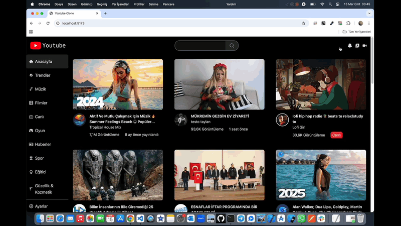

# Youtube-Clone 📹

<li>Bu proje Youtube-Clone site arayüzü içerir.</li>
<li>Proje kullanıcılar için kategorilere ayrılmış videolar yer almaktadır.</li>
<li>Herbir video için detay kısmında görüntüleme,kanal ismi,abone sayısı,izlenme oranı,beğenme oranı ve yorumlara erişim mevcuttur.</li>
<li>Arama özelliği ile istenilen video kolaylıkla bulunabilir.</li>
<li>Kullanıcı dostu responsive tasarımı mevcuttur.</li>

# Kullanılan Teknolojiler 🎨

<li>⭐ React</li>
<li>⭐ Vite</li>
<li>⭐ TailwindCss</li>
<li>⭐ React-Icons</li>
<li>⭐ React-Player</li>
<li>⭐ Axios</li>
<li>⭐ Millify</li>
<li>⭐ Apı</li>

# Ekran Görüntüsü 🎥
      

# İletişim 📩
yunusemreoral@hotmail.com.tr
